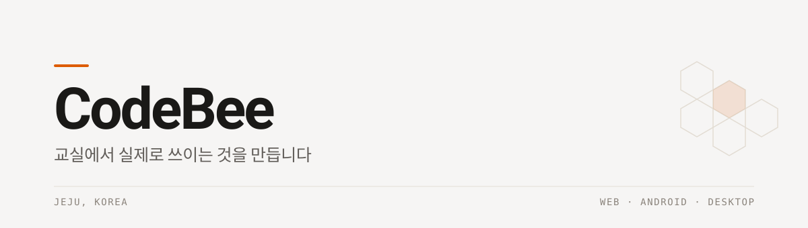

<picture>
  <source media="(prefers-color-scheme: dark)" srcset="./assets/header-dark.svg">
  
</picture>

 

교육 현장에서 실제로 겪은 불편을 코드로 풉니다.
필요한 자리에 맞는 형태를 고릅니다 — 웹이든, 안드로이드든, 데스크톱이든.

 

## Now

### RhythmTalk

말이 지나치게 빠르거나 불규칙해지는 **속화증(Cluttering)** 을 위한 안드로이드 앱입니다.
말더듬과 달리 잘 알려져 있지 않아, 자신이 해당되는지조차 모르는 경우가 많습니다.

한 연구에서 속화 특성을 스스로 보고한 사람 중 실제로 언어치료를 받은 사람은 **21%**에 그쳤습니다.
문제는 치료법이 없다는 것이 아니라, 치료에 닿지 못한다는 것이었습니다.

1900년부터 현재까지의 국제 문헌 260여 건을 직접 정리해 설계의 근거로 삼았습니다.
말속도만이 아니라 **리듬의 불규칙성**을 함께 측정합니다 — 최근 연구는 리듬이 더 유효한 지표일 수 있다고 봅니다.
한국어권에는 속화증만을 다룬 연구가 거의 없어, 규준 데이터를 함께 쌓는 것을 목표로 하고 있습니다.

비공개 개발 중 · Kotlin · Jetpack Compose · 온디바이스 음향 분석

 

## Shipped

**[JEST](https://play.google.com/store/apps/details?id=kr.codebee.jest)** — 축구 포지션을 정해주는 앱
매번 같은 아이가 같은 자리에 서지 않도록. · Android · Google Play

**[MeXEL](https://github.com/ByeongsuKim/MeXEL)** — 엑셀 파일을 하나로 합치는 프로그램
반복 작업을 없애려고 만들었습니다. · Python · Windows

 

## Classroom

교실에서 바로 쓰려고 만든 것들입니다.

**[j-padlet](https://github.com/ByeongsuKim/j-padlet)** — 제주교육용 패들렛
TypeScript

**[JEJUAI_V2](https://github.com/ByeongsuKim/JEJUAI_V2)** — 제주교육 AI 플랫폼
TypeScript

**[classapp_election](https://github.com/ByeongsuKim/classapp_election)** — 학급 디지털 선거 앱
Dart · Flutter

**[BoggleBoggle](https://github.com/ByeongsuKim/BoggleBoggle)** — 문해력 향상 웹앱
Web

 

## Lab

만들면서 배우는 작은 것들.

[visualwoofer](https://github.com/ByeongsuKim/visualwoofer) · [pickmeup](https://github.com/ByeongsuKim/pickmeup) · [jest25](https://github.com/ByeongsuKim/jest25) · [CSS_Drawing](https://github.com/ByeongsuKim/CSS_Drawing)

 

## Tools

TypeScript · Kotlin · Dart / Flutter · Python · HTML / CSS

 

---

 

## Contact

만든 것에 대한 이야기도, 교실에 필요한 도구에 대한 제안도 환영합니다.

**[code.ssu@gmail.com](mailto:code.ssu@gmail.com)**
**[YouTube @CodeBeeKr](https://www.youtube.com/@CodeBeeKr)**

 

만드는 것이 곧 배우는 방법이라고 믿습니다.
